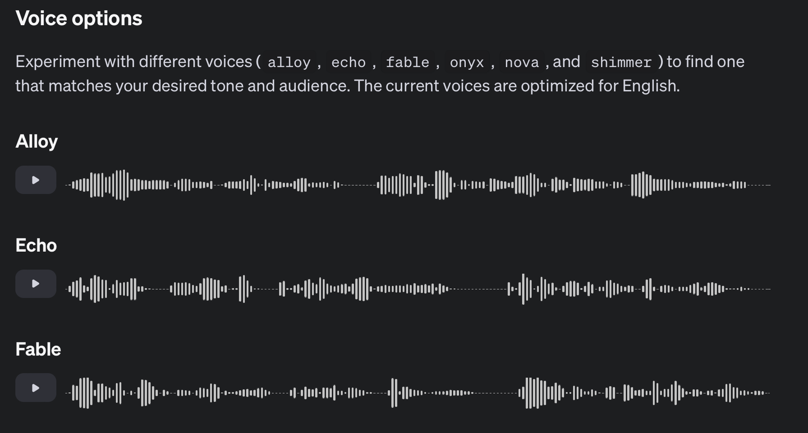

# 1. イントロダクション

## OpenAI API へのアクセス方法

トップページの Products を選択

API関連のリンクが表示される

## Platform overview

GPT-4o と GPT-4o mini が代表的なモデル

GPT-4o は最も賢く、複雑なタスクに向いている。
GPT-4o mini は GPT-4o の簡易版で、簡単なタスクに向いている。
料金が30倍ぐらい異なる。

大規模言語モデルへのアクセスは API を介して行う。

### Chat Completions API

初期からあるシンプルで使いやすい API

### Assistants API

サービス開発で一般的に使用する API。Chat Completions API よりも複雑で、色々作れる。

### Batch API

大量の文章を API が空いている時間に一括で処理することで 50% のコスト削減が可能。

### Knowledge retrieval

PDF などをアップロードするだけで回答してくれたり、文章をベクトル化して RAG を実装できる。
結構使う。

### Code interpreter

高度な数学の問題など Python コードをサーバ上で実行し回答できる。

### Function calling

自然言語の入力をもとに外部 API を呼び出し回答できる。

### Vision

画像に含まれている物なのに対して回答できる。

### JSON Mode

Chat Completions API による回答を全て JSON で出力できる。

### Streaming

現行の ChatGPT のように回答をストリームで取得できる。

### Fine-tuning

モデルの知識をカスタマイズしたり、特定のタスクを解いたり振る舞いを変更できる。

### Playground

Playground を使い OpenAI のWebサービス上で API の挙動を確認できる。

### DALLE-3

テキストから画像を生成できる。

### TTS（Text to Speech）

テキストを人の声に変換できる。

### Whisper

人の声をテキストに変換できる。

## まとめ

ワークショップではこれらの API を組み合わせて面白いプロダクトを作ります！
