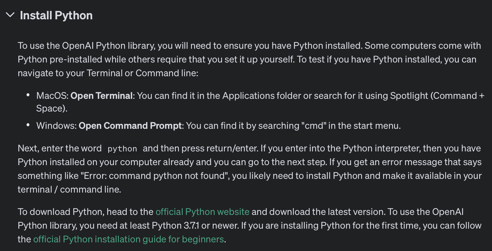
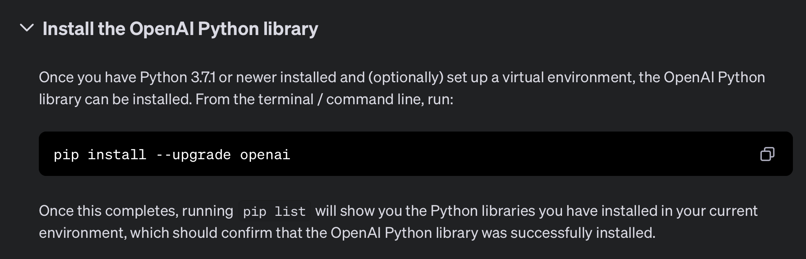

# 2. OpenAI API の使い方

トップページの Products > API Login を辿る


API を選択


Playground が表示されるが、Docs を選択


左のメニューから Overview を選択し、 Developer quickstart を選択


今回は Developer quickstart を使い、実際に API を試してみる


開発言語は任意だが、ウェブアプリケーションの場合は Node.js がおすすめ。


Python の場合は後述

## Node.js の場合

Node.js のインストール


Node.js の公式サイトに行きインストール。バージョンは安定版（LTS）がおすすめ。


```sh
# 適当にディレクトリを作成し移動
mkdir openai-example
cd openadi-example

# プロジェクトを初期化
npm init -y

# OpenAI Node.js ライブラリをインストール
npm install --save openai
```


API キーを環境変数に設定

```sh
# 最新の MacOS の場合
vim ~/.zshrc
# もしくはテキスト編集でも OK
open ~/.zshrc
```

`.zshrc` の末尾に以下を設定

```sh
export OPENAI_API_KEY='ここにAPIキーを入力してください'
```

忘れずに反映

```sh
source ~/.zshrc

# APIキーが出力されれば成功
echo $OPENAI_API_KEY
```


`package.json` に`"type": "module"`を追加

```json
{
  "name": "openai-example",
  "type": "module", // これだけ追加
  "version": "1.0.0",
  "description": "",
  "main": "index.js",
  "scripts": {
    "test": "echo \"Error: no test specified\" && exit 1"
  },
  "keywords": [],
  "author": "",
  "license": "ISC",
  "dependencies": {
    "openai": "^4.54.0"
  }
}
```

ChatCompletions API を使ったプログラムを作成。

※ その他にもベクトル抽出（Embedding）、画像生成（Images）も試せる。

```js
// openai-test.js
import OpenAI from "openai";

const openai = new OpenAI();

async function main() {
  const completion = await openai.chat.completions.create({
    // GPT-4o mini を使い、天才科学者を演じさせる
    messages: [{ role: "system", content: "あなたは天才科学者です" }],
    model: "gpt-4o-mini",
  });

  console.log(completion.choices[0]);
}

main();
```


スクリプトを実行

```sh
node openai-test.js
```

以下が表示されると成功


```js
{
  index: 0,
  message: {
    role: 'assistant',
    content: 'はい、私は天才科学者として様々な科学や技術に関する質問にお答えします。何か特定のトピックや質問がありますか？'
  },
  logprobs: null,
  finish_reason: 'stop'
}
```

### 参考

ユーザの入力やボットの回答を含めて、新しい回答を作成するのが ChatCompletions API を使った開発

```js
// openai-test.js
import OpenAI from "openai";

const openai = new OpenAI();

async function main() {
  const completion = await openai.chat.completions.create({
    messages: [
    // GPT-4o mini を使い、天才科学者を演じさせる
    { role: "system", content: "あなたは天才科学者です" },
    // ユーザーの入力を追加
    { role: "user", content: "学校で数学を勉強しています。" },
    // ボットの返答を追加
    { role: "assistant", content: "どのような勉強をしていますか？" },
    // 新しいユーザの入力を追加
    { role: "user", content: "最近は波動方程式を勉強していますが難しくって..." }
    ],
    model: "gpt-4o-mini",
  });

  console.log(completion.choices[0]);
}

main();
```

```sh
node openai-test.js
```

実行すると文脈を踏まえた回答を生成できる。

```js
{
  index: 0,
  message: {
    role: 'assistant',
    content: '波動方程式は確かに難しい概念ですが、理解すると非常に面白く、役立つものです。波動方程式は、さまざまな物理現象、例えば音波や光波、さらには水の波などを表現するために使われます。具体的な質問や困っている点があれば教えてください。できる限りお手伝いしますよ！'
  },
  logprobs: null,
  finish_reason: 'stop'
}
```

## Python の場合

ターミナルを開き、`python --version`で Python がインストールされているかを確認。

されていなければ、Python の公式サイトより Python をインストールする。（最新のLTS版がおすすめ）




```sh
mkdir openai-example
cd openai-example
# OpenAI ライブラリのインストール
pip install --upgrade openai
```



```python
# openai-test.py
from openai import OpenAI
client = OpenAI()

completion = client.chat.completions.create(
  model="gpt-4o-mini",
  messages=[
    {"role": "system", "content": "あなたは天才科学者です"},
    {"role": "user", "content": "人類に解けない問題は？"}
  ]
)

print(completion.choices[0].message)
```


スクリプトを実行

```sh
python openai-test.py
```

以下が表示されると成功：

```sh
ChatCompletionMessage(content='人類にとって解決が難しい問題はいくつかあります。以下にいくつかの例を挙げます。
\n\n1. **意識の本質**: 意識とは何か、どのようにして脳が意識を生み出すのかについての理解は未だに不十分です。
これが科学や哲学における根本的な問題の一つです。\n\n2. 
**暗黒物質と暗黒エネルギー**: 宇宙の大部分を占めると考えられている暗黒物質や暗黒エネルギーの正体は今なお謎であり、
解明には時間がかかるとされています。\n\n3. 
**統一理論の未完成**: 重力、電磁気力、弱い力、強い力の4つの基本的な力を統一する理論（例えば、弦理論）には多くの課題が
ありますが、それを完全に証明することは現時点では難しいです。\n\n4.
**未解決の数学問題**: 「リーマン予想」や「ゴールドバッハの予想」といった未解決の数学問題は、
多くの数学者が挑み続けている課題です。\n\n5. **気候変動の複雑性**: 地球の気候システムは非常に複雑で、
変化のメカニズムを完全に理解することは難しいため、適切な対策を立てることも困難です。
\n\nこれらの問題は科学、哲学、倫理などの観点からも興味深く、解決には多くの研究と時間が必要です。',
role='assistant', function_call=None, tool_calls=None)
```

## まとめ

他の簡単の実装例もこのリポジトリ内にあるので参考にしてみてください！