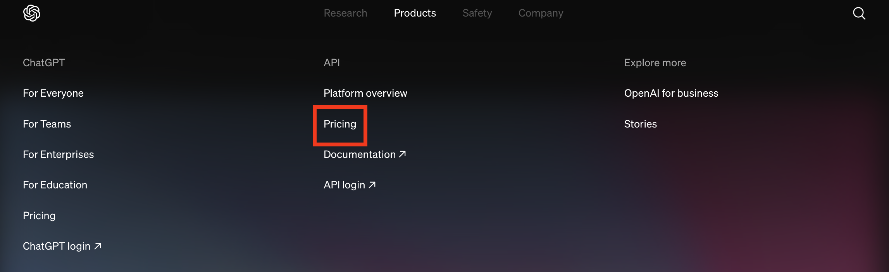
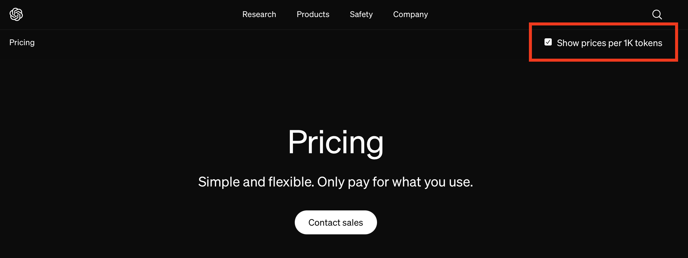
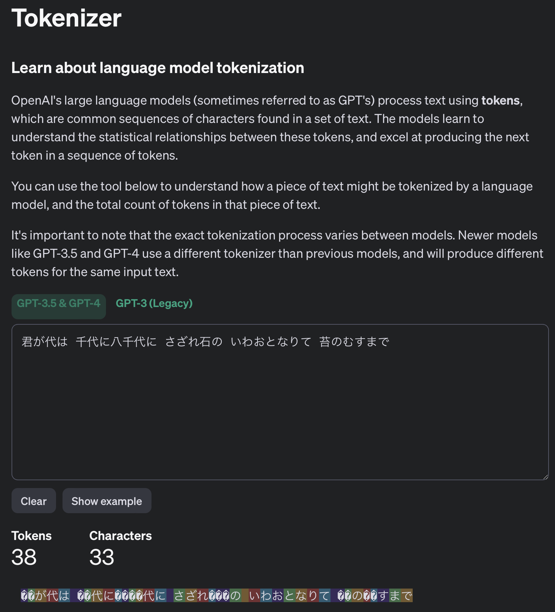
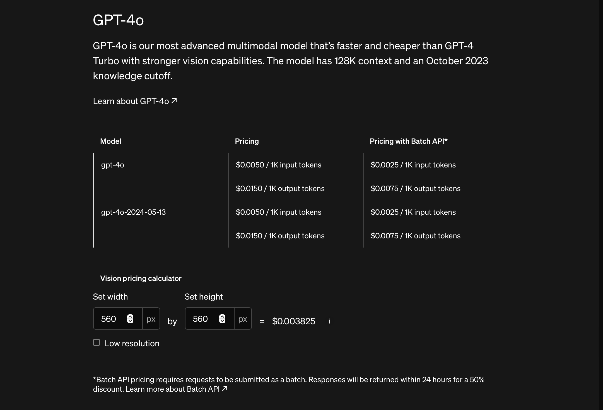
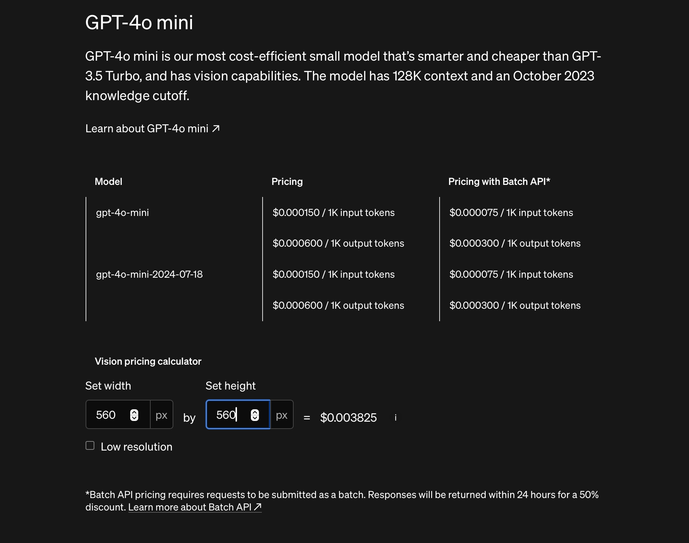

# 3. API の利用料金

トップページのメニューから Pricing を辿る



ChatGPT と OpenAI API は料金体系も全く別で従量課金制

右上のチェックマークをクリックし、1000トークンあたりの料金を表示できる



トークンは単語のような単位

- 英語の場合；1,000トークン $\approx$ 750 単語
- 日本語の場合：1,000トークン$\approx$ 1,000 文字

[Tokenizer](https://platform.openai.com/tokenizer) でトークン数を調べられる

例えば君が代の１番（33 文字）のトークン数は 38 トークン

💡 一般的に英語を使うと日本語のトークン数の半分ぐらいに抑えられる



1000トークン（978文字）の例：

```jsx
福岡市をエンジニアの聖地にしよう。
エンジニアカフェは、そんな想いが起点となって生まれた官民一体のプロジェクトです。
エンジニア・エコシステム個人やコミュニティを核としたエンジニア・エコシステムを
創造していくべく、多様性を求め、出会いが成長や協業へ繋がり、
玉石混交なアウトプットが次々に生み出される場所です。
個人やコミュニティをサポートエンジニアやエンジニアに関わる方、
エンジニアを目指す方からのさまざまな相談に対応、活躍できる環境づくりをサポートいたします。
業種などの垣根を超え、エンジニア同士の多様多種なコミュニケーションを促進し、
エンジニアにとってあらゆる機会を創出します。
エンジニアカフェは、エンジニアが集まる、活躍する、成長する街、福岡の実現を目指す
「エンジニアフレンドリーシティ福岡」の取り組みのひとつとして誕生しました。
エンジニアフレンドリーシティ福岡イベント国内外から様々なエンジニアが集まる魅力的なイベントを
開催様々な技術トピックのイベントに会場を提供し、エンジニアの成長や活躍をサポートいたします。
イベント一覧を見るエンジニアカフェでは、エンジニアの育成/成長/交流等に関連するイベント企画を
受け付けています。詳細についてはこちらから
相談エンジニアを取り巻く環境について、様々な相談を受け付けエンジニアやエンジニアに関わる方、
エンジニアを目指す方からの相談に対応、活躍できる環境づくりをサポートいたします
Community Manager、Hacker Supporterへのご相談についてはTOPICSでご案内しております。
OVERVIEW名称	
Engineer Cafe ‒ Hacker Space Fukuoka ‒TEL080-6742-7231
開設年月2019年8月営業時間9:00 - 22:00相談受付時間13:00-21:00
休館日	毎月最終月曜日(祝休日のときは翌平日)、12/29〜1/3
運営事業者株式会社 サイノウ特定非営利活動法人 AIP所在地	福岡市赤煉瓦文化館内
(福岡市中央区天神1丁目15番30号)Engineer CafeHacker Space Fukuoka
赤煉瓦文化館福岡市中央区天神1丁目15番30号地下鉄天神駅 徒歩5分 / 西鉄バス「天神4丁目」
※駐車場、駐輪場は併設しておりません。
```

💡 Batch API を使い、生成に1日の猶予を設ければ 50% 価格を抑えることもできる

## GPT-4o API の利用料金

料金は API への入力と出力の両方にかかる。

- 入力 $0.005 （0.75 円）/ 1,000トークン
- 出力 $0.015 （2.25円）/ 1,000 トークン

合計 **3.0 円 / 回答**




追加で画像（560 x 560）を入力すると

- 入力 $0.005 （0.75 円） / 1,000 トークン
- 画像入力 $0.003825 （0.57 円）
- 出力 $0.015 （2.25円）

合計 **3.6円 / 回答**

560 x 560 の画像の例


## GPT-4o mini API の料金

GPT-4o は最もコスパが良いモデル

- 入力 $0.000150（0.0225円） / 1,000 トークン
- 出力 $0.000600（0.0900円） / 1,000 トークン

合計 **0.112 円 / 回答**

GPT-4o より 30 倍ぐらい安い



## まとめ

その他の API の料金の計算方法もだいたい同じなので、ウェブサイトで確認してみてください！