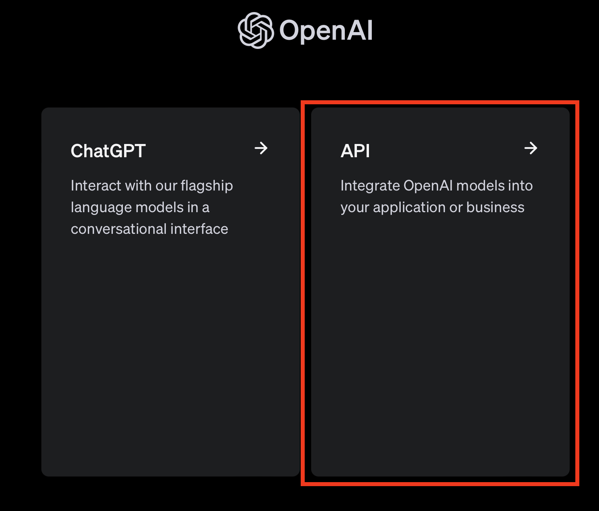

# APIキーの取得方法

トップページのメニューより API login を選択

API を選択

Dashboard を選択

Engineer Cafe Lab プロジェクトが選択されていることを確認後、API keys を選択

Create new secret key を選択

シークレットキーの設定。わかりやすい名前にしておく。

APIキーをコピーし環境変数に設定（「2.OpenAI APIの使い方」参照 ）

